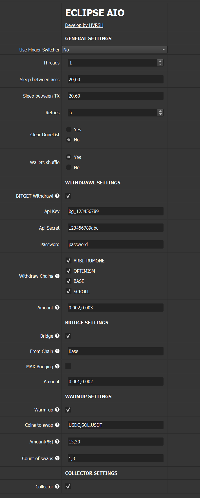

# ECLIPSE AIO

Written by: @hvrsh (TG)

Channel: https://t.me/hashvers

---
**Automation of Interactions with Eclipse Chain**

**Configuration upon launching `eclipseAIO.xml`:**

Withdraw, bridge swap and collect coins in Eclipse Chain 

All descriptions is right on the script

**Files for Work**

`privateEVM.txt` - privates from EVM wallets(need for withdraw and bridge mode).

`privateSOL.txt` - privates from Eclipse wallets.

`proxy.txt` - proxies in any standard format (ip:port:log:pass)
